# Photo-Album
- Una App Donde Puedes Subir Imágenes ( jpg png), y para subir imágenes tienes que log in 

- Si deseas descargar este codigo necesitaras tener instalado composer y ejecutar el siguiente comando 

	` composer install`   ó ` php composer install`

- Ahora le Pondre unas serie de  imagenes donde haremos la simulacion de la app , cabe recalcar que esta app esta hecha en PHP por lo tanto necesitamos  un servidor pero lo haremos de esta manera con las imagenes 

- Nos Log-in 
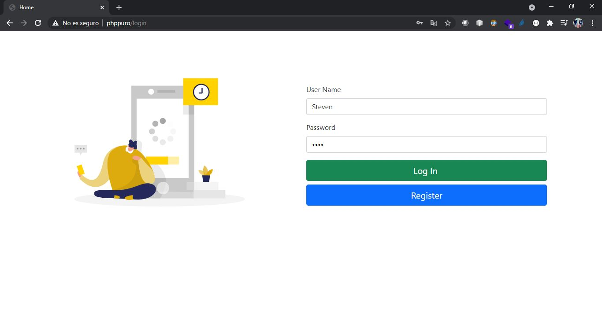
- Nos Da Error (Not Found ) Por que no tenemos el usuario
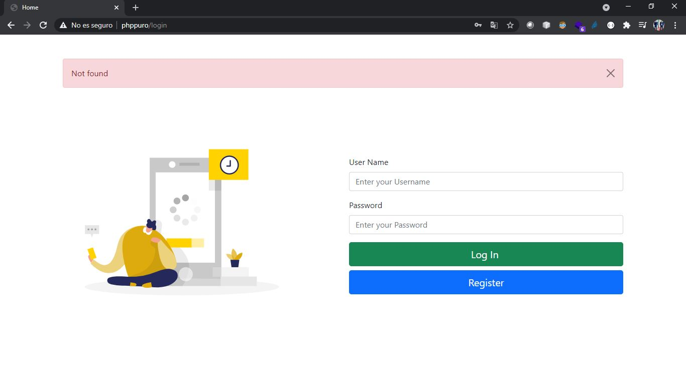
- Nos Registramos
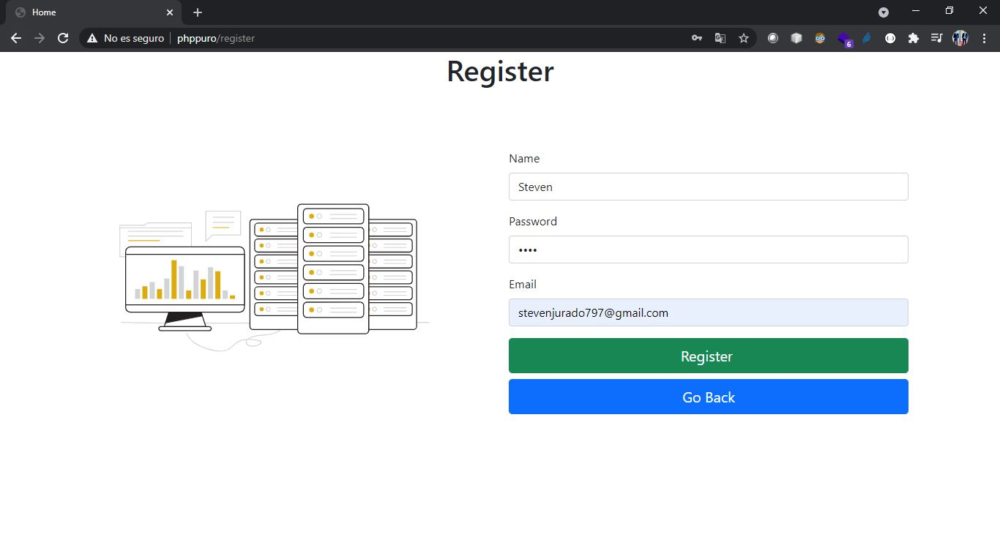
- Registro con Exito
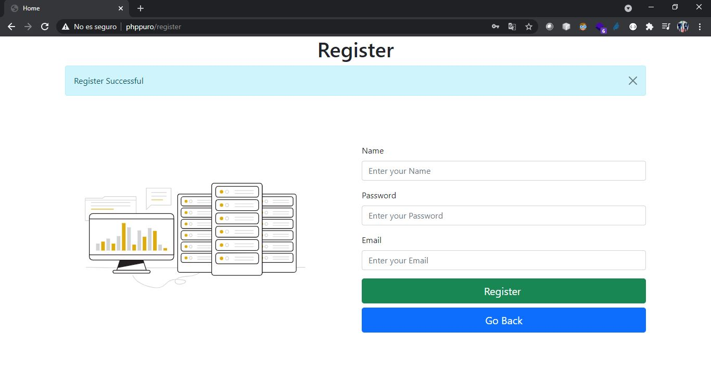
- Login

- Entramos a la raiz y vemos que no tenemos ninguna imagen subida
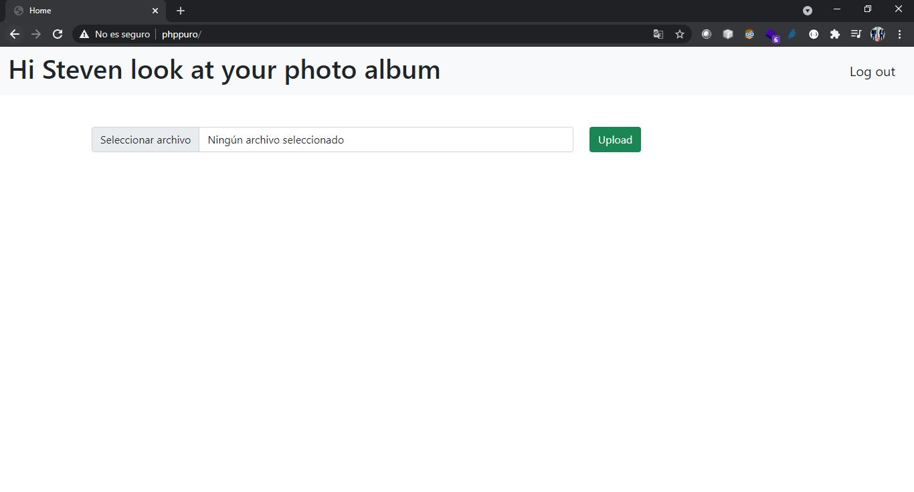
- Subimos un Archivo .png
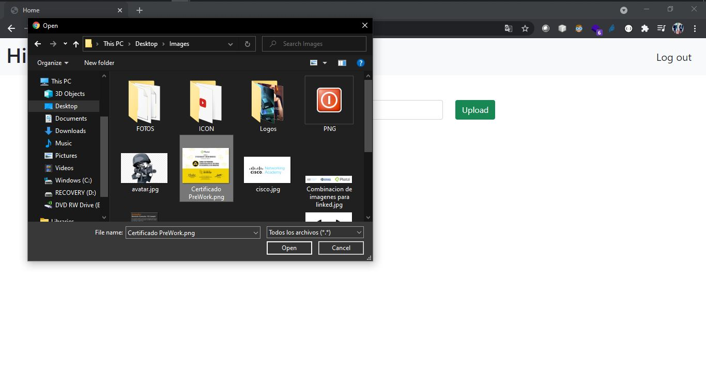
- Luego lo  Renderizamos en el route Raiz 
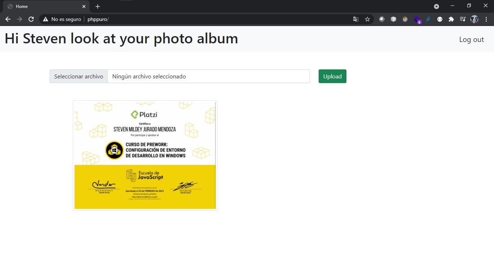
- Subimos Mas imagenes 
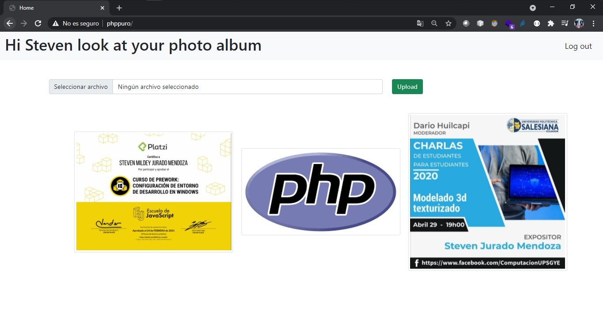
- Luego Log Out
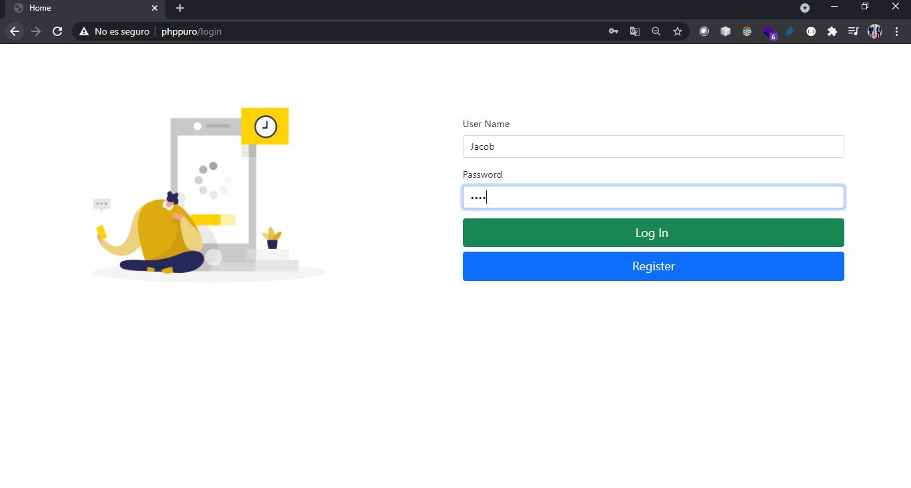
- Registramos otro usuario y Log in 
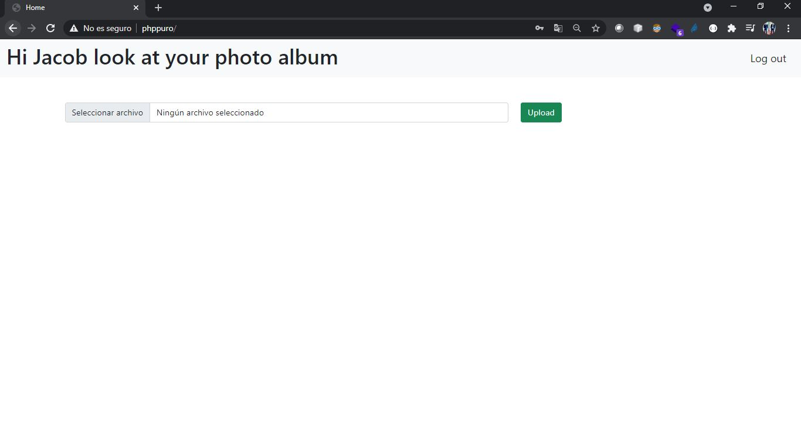
- Subimos imagenes y lo renderizamos 
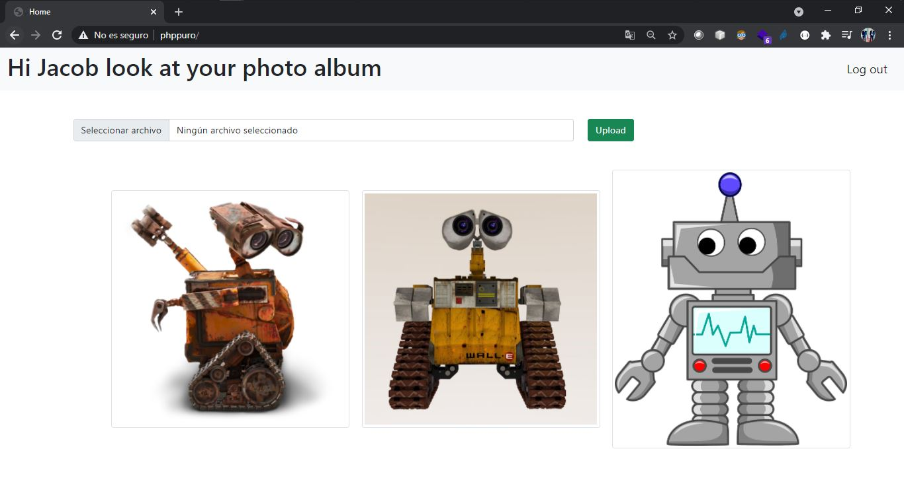

` Gracias`
